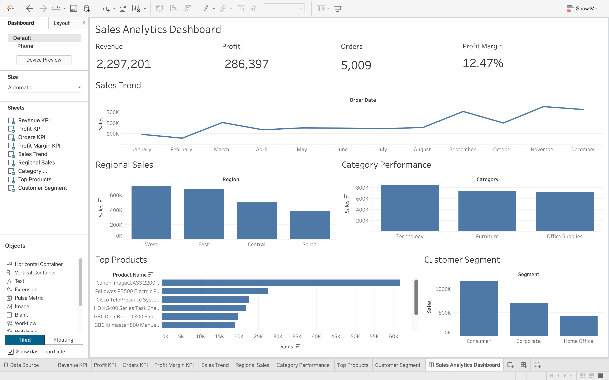

# Sales Analytics Dashboard

## Overview

This project focuses on analyzing retail sales data through an interactive dashboard to monitor business performance and support data-driven decision-making.

The dashboard provides insights into revenue, profit, product performance, customer purchasing patterns, and regional sales trends using key performance indicators (KPIs) and visual analytics.

## Tools Used

* Tableau Public
* CSV Dataset
* Data Cleaning & Transformation
* Data Visualization

## Key Metrics

* Total Revenue
* Total Profit
* Total Orders
* Profit Margin (%)

## Dashboard Features

### Sales Trend Analysis

Tracks revenue trends over time to identify seasonal patterns and business growth.

### Regional Sales Analysis

Compares sales performance across different regions to identify high-performing markets.

### Category Performance Analysis

Evaluates revenue contribution from different product categories.

### Top Products Analysis

Highlights the highest revenue-generating products.

## Business Insights

* Identified top-performing regions based on sales revenue.
* Analyzed category-wise sales contribution.
* Tracked revenue and profit KPIs for business monitoring.
* Identified best-selling products for inventory and sales optimization.
* Observed sales trends to support strategic decision-making.

## Project Structure

sales-analytics-dashboard

├── Dataset

├── Dashboard

├── Result

└── README.md

## Dashboard Preview

Add the dashboard screenshot below:

## Future Enhancements

* Customer segmentation analysis
* Advanced profitability analysis
* Interactive drill-down reports
* Power BI implementation with DAX measures
